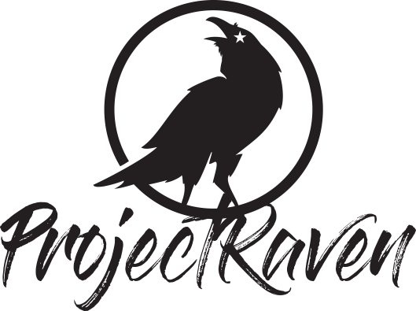

<p align="center">
	<a href="https://raven.gt" target="_blank">
		
	</a>
</p>

<h3 align="center">JavaScript utilities for ProjectRaven's Odin server</h3>

<hr/>

Version 0.1.0  


#### Installation
--------
```console
npm install odin-js --save
```


#### Usage
--------
```js

// instance the Odin JS tools
var odinjs = require("odin-js")

// return data extracted form the MQTT topic string
odinJs.parser.describeTopic("raven-1001/data/T1")

// converts 1024 bytes to Kilobyte with binary base
odinJS.convert.bytesToH(1024)

```


### License  
------
Software developed in [Guatemala](http://visitguatemala.com/) distributed under the *General Public License v 3.0* you can read the full license [here](http://www.gnu.org/licenses/gpl-3.0.html)

<p align="center">
	<a href="https://www.lesli.tech" target="_blank">
		
	</a>
</p>
